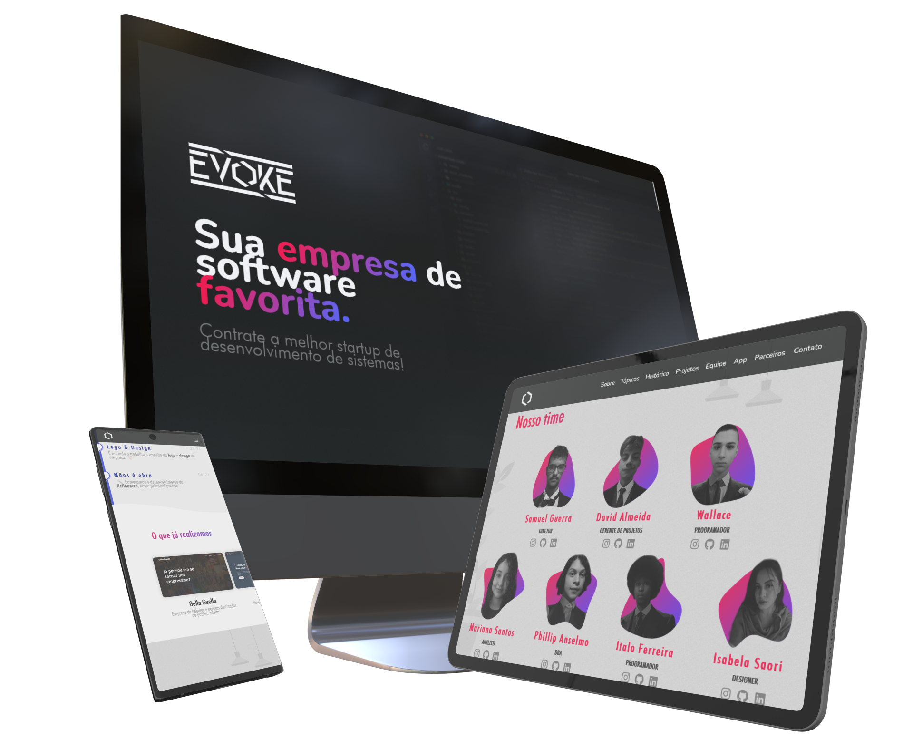

 

<h1 align="center">
    
</h1>

 

  <a href="#-Tecnologias">Tecnologias</a>&nbsp;&nbsp;&nbsp;|&nbsp;&nbsp;&nbsp;
  <a href="#-Projeto">Projeto</a>

    
    

  

### 🚀 Tecnologias

- [HTML](https://www.w3schools.com/html/)
- [CSS](https://www.w3schools.com/css/)
- [SASS](https://sass-lang.com/)
- [JS](https://developer.mozilla.org/pt-BR/docs/Web/JavaScript/)
- [Flickity](https://flickity.metafizzy.co/)
- [JQuery](https://jquery.com/)
- [FontAwesome](https://fontawesome.com/)

 

### 🤳 Projeto

Trata-se de um website responsivo construído sem frameworks para uma empresa fictícia chamada Evoke, criada para o projeto do TCC do curso de Desenvolvimento de Sistemas na Etec de Guaianazes. A nota final foi MB (Muito Bom) e equivale a 10.

O site está hospedado no GitHub Pages: https://almeida154.github.io/evoke-website/

 
